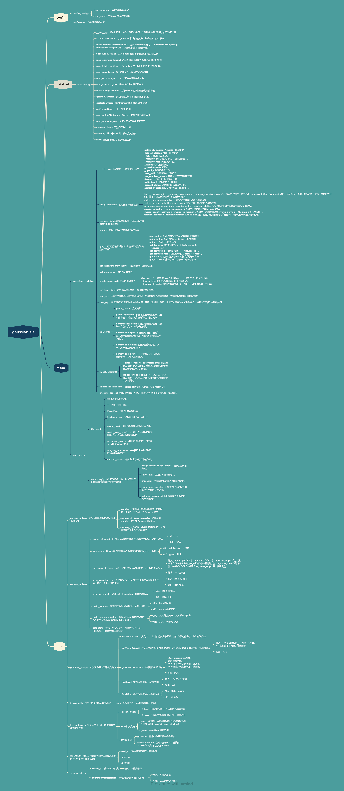

# Gaussian_slt
This is a replicated set of code for personal learning purposes.
## Set up
This code is developed with `python3.9.21`. PyTorch 2.5.1 and cuda 12.2 are required.  
It is recommended use `Anaconda` to set up the environment. Install the dependencies and activate the environment `3dgs-env` with
```
conda env create --file requirements.yaml
conda activate 3dgs-env
```
## Running
To train the model:
```
python train.py 
```
To render the model:
```
python test.py 
```
`source_path` and `model_path` can be configured in the `config.yaml` file.
## Some small episodes
1.pytorch和cuda版本对应关系以及安装命令:`https://pytorch.org/`

2.`pip install submodules/diff-gaussian-rasterization`失败，最后发现原因是`submodules/diff-gaussian-rasterization/third_party/glm`是空的，把`glm`源码下载过来就可以了


## 代码架构

## 计算机图形学

## 高斯方法架构
